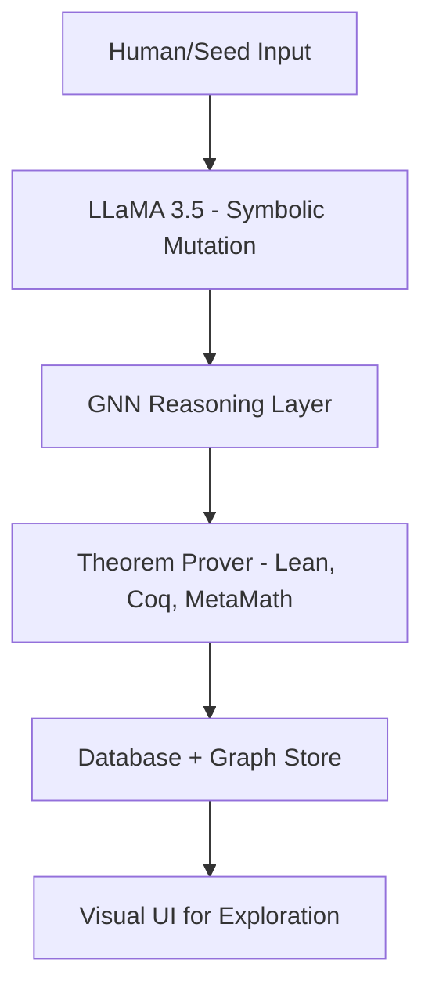

# 🚀 NeuroMath: Redefining Mathematical Discovery with AI

> *"Not just another AI project. A new frontier in how machines think, prove, and discover mathematical truths."*

---

## 📜 Table of Contents

* [Why NeuroMath?](#why-neuromath)
* [The Vision: What We Set Out to Solve](#the-vision-what-we-set-out-to-solve)
* [How It Works: System Intelligence Flow](#how-it-works-system-intelligence-flow)
* [What We've Built: Features and Impact](#what-weve-built-features-and-impact)
* [Test Cases: Real Mathematical Use-Cases](#test-cases-real-mathematical-use-cases)
* [LLaMA 3.5 Integration](#llama-35-integration)
* [System Architecture](#system-architecture)
* [Project Timeline](#project-timeline)
* [Professional Documentation & Artifacts](#professional-documentation--artifacts)
* [Team & Contact](#team--contact)

---

## Why NeuroMath?

Mathematics is the final frontier of structured thought where even the best AI struggles. NeuroMath was built not to automate math, but to **transform** it.

We didn’t build this for grades. We built it because we couldn’t stop thinking about the question: *Can machines create and understand mathematical truths like we do?*

This isn't a side project. It's an invitation to reimagine logic, proof, and symbolic intelligence.

* Can AI co-create new theorems?
* Can we blend formal rigor with generative exploration?
* Can symbolic engines evolve their logic like neural minds?

**NeuroMath is a belief system turned into code.**

---

## The Vision: What We Set Out to Solve

Traditional theorem provers demand precision but lack intuition.
Neural networks explore patterns but lack grounding.
We fused them — to bring structure to thought and creativity to logic.

✅ Discover original theorems in hyperbolic & non-Euclidean geometry
✅ Refine axioms through symbolic + neural mutation
✅ Validate logic using Lean, Coq, MetaMath
✅ Train GNNs on mathematical proof graphs
✅ Store proofs in PostgreSQL and graph relationships in Neo4j

---

## How It Works: System Intelligence Flow



Each block is independent. Extensible. Interpretable.
This isn’t black-box AI. It’s **visible thinking**.

---

## What We've Built: Features and Impact

* 🧠 **LLM-driven Theorem Generation**
* 🔍 **GNN-based Symbolic Relationship Prediction**
* ✅ **Formal Proof Verification** using Lean, Coq, MetaMath
* 🌐 **Neo4j Knowledge Graphs** for theorem dependencies
* 📊 **UI Interface** to explore proofs and queries
* 📁 **Structured Representations** in XML, JSON

**📰 Published**: Peer-reviewed in IJRPR, May 2025
**📆 Duration**: Jan 26 – May 25, 2025
**🧾 Backup Verified**: July 6, 2025 (screenshot proof)

---

## 🧪 Test Cases: Real Mathematical Use-Cases

### 📍 Test Case 1: Proving a Theorem in Hyperbolic Geometry


### 📍 Test Case 2: Generating a Conjecture in Fractal Geometry


### 📍 Test Case 3: Explaining a Concept in Non-Euclidean Geometry


### 📍 Test Case 4: Refining a Previous Output in Hyperbolic Geometry


### 🌐 Neo4j Graph Output


### 📈 GNN Training Output


### 🛠️ System Architecture


### 🗄️ PostgreSQL Snapshot


---

## 🧠 LLaMA 3.5 Integration

LLaMA 3.5 was used to generate symbolic reasoning variants through prompt mutation.

```bash
# Example usage
python llama_runner.py --prompt "Refine this theorem: ..."
```

Secrets are stored securely using `.env`, with push protection enforced by GitHub.

---

## 🏗️ System Architecture Overview

* 🤖 **LLM**: LLaMA 3.5 (via llama.cpp)
* 📐 **Symbolic Engines**: Lean, Coq, MetaMath
* 🔗 **Graph AI**: PyG, GATv2
* 🗄️ **Databases**: PostgreSQL, Neo4j
* 🧠 **Middleware**: Flask, py2neo, Torch

---

## 📆 Project Timeline (Gantt)

| Phase               | Date Range      |
| ------------------- | --------------- |
| Ideation & Planning | Jan 26 – Feb 10 |
| Prototype Modeling  | Feb 11 – Mar 10 |
| GNN + DB Layer      | Mar 11 – Apr 10 |
| Integration Phase   | Apr 11 – May 10 |
| Final Docs + Tests  | May 11 – May 25 |
| 📸 Backup Verified  | July 6, 2025    |

---

## 📚 Professional Documentation & Artifacts

| 📄 File Name                                                      | Description                      | Link                                                                                                                                              |
| ----------------------------------------------------------------- | -------------------------------- | ------------------------------------------------------------------------------------------------------------------------------------------------- |
| BCA\_FYP\_42\_Ai\_Driven\_Mathematical\_Theorems\_And\_Axioms.pdf | Final Project Documentation      | [View](https://github.com/manjunathakoshinum/AI-Theorem-Discovery/blob/theorem-ai/docs/BCA_FYP_42_Ai_Driven_Mathematical_Theorems_And_Axioms.pdf) |
| publication\_of\_unconventional\_mathematics.pdf                  | Published Research Paper         | [View](https://github.com/manjunathakoshinum/AI-Theorem-Discovery/blob/theorem-ai/docs/publication_of_unconventional_mathematics.pdf)             |
| certificate of publication of paper.png                           | Certificate of Paper Publication |  |
| UI-interface.png                                                  | Screenshot of UI Interface       |                                 |

---

## 🤝 Team & Contact

| Name                | Role                              |
| ------------------- | --------------------------------- |
| Manjunatha Koshinum | Lead Architect – AI & GNN Systems |
| Akhil Nag           | Symbolic Logic & Formal Math      |
| Varshi RDX          | Model Engineering + Testing       |
| T Sai Reddy         | Proof Integration & Evaluation    |

📫 Contact:

* 📩 [manjunathakoshinum@gmail.com](mailto:manjunathakoshinum@gmail.com)
* 🔗 [LinkedIn](https://www.linkedin.com/in/manjunathah)

---

> *“We didn’t build NeuroMath to impress. We built it to express what we believe AI can become in the language of mathematics.”*

**Crafted like a product. Polished like a theory. Driven by belief.**
