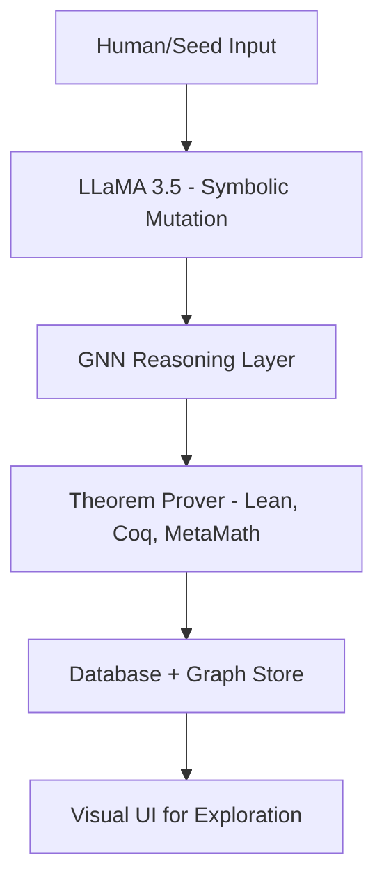

# 🚀 NeuroMath: Redefining Mathematical Discovery with AI

> *"Not just another AI project. A new frontier in how machines think, prove, and discover mathematical truths."*

---

## 📜 Table of Contents

* [Why NeuroMath?](#why-neuromath)
* [The Vision: What We Set Out to Solve](#the-vision-what-we-set-out-to-solve)
* [How It Works: System Intelligence Flow](#how-it-works-system-intelligence-flow)
* [What We've Built: Features and Impact](#what-weve-built-features-and-impact)
* [Test Cases: Real Mathematical Use-Cases](#test-cases-real-mathematical-use-cases)
* [LLaMA 3.5 Integration](#llama-35-integration)
* [System Architecture](#system-architecture)
* [Project Timeline](#project-timeline)
* [Professional Documentation & Artifacts](#professional-documentation--artifacts)
* [Team & Contact](#team--contact)

---

## Why NeuroMath?

Mathematics is the final domain where machines still trail minds.
NeuroMath changes that. This project is not about automation — it is about **evolution of thought**.

We built NeuroMath to answer bold questions:

* Can AI generate and refine original theorems?
* Can symbolic logic and deep learning co-create?
* Can formal mathematics be both provable *and* creative?

**NeuroMath isn’t an academic exercise — it’s an intellectual leap.**

---

## The Vision: What We Set Out to Solve

Traditional theorem proving is rigid.
Pure neural models lack structure.
We fused both.

**From symbolic rigor to neuro-inspired evolution**, we wanted to:

✅ Discover new theorems in hyperbolic & non-Euclidean geometry
✅ Refine or mutate axioms based on formal systems
✅ Validate outputs using Lean, Coq, and MetaMath
✅ Use LLMs and GNNs to learn abstract mathematical patterns
✅ Present results in structured, explainable, verifiable form

---

## How It Works: System Intelligence Flow

Our stack merges LLM creativity, graph logic, and formal provers.



Each block is modular and extensible. Output from LLaMA feeds into GNNs that form symbolic reasoning clusters. Theorems are verified and indexed using PostgreSQL + Neo4j.

---

## What We've Built: Features and Impact

* 🧠 **AI-Powered Theorem Generation** using structured prompts + LLaMA 3.5
* 🔎 **GNN-based Prediction** for symbolic structure linkage
* ✅ **Formal Proof Validation** with Lean, Coq, and MetaMath
* 🌐 **Theorem Graphs** using Neo4j knowledge graphs
* 🗂️ **Structured Representation** in XML / JSON
* 📊 **UI Interface** for query + exploration

**Published**: Peer-reviewed in IJRPR, May 2025
**Duration**: Jan 26 → May 25, 2025
**Backup Verified**: July 6, 2025 (screenshot proof)

---

## Test Cases: Real Mathematical Use-Cases

| Test Case | Domain                                         | Link                       |
| --------- | ---------------------------------------------- | -------------------------- |
| 1         | Proving a Theorem in Hyperbolic Geometry       | [View](PLACEHOLDER_LINK_1) |
| 2         | Generating Conjecture in Fractal Geometry      | [View](PLACEHOLDER_LINK_2) |
| 3         | Explaining a Concept in Non-Euclidean Geometry | [View](PLACEHOLDER_LINK_3) |
| 4         | Refining Prior Output in Hyperbolic Geometry   | [View](PLACEHOLDER_LINK_4) |
| 5         | Graph Output (Neo4j)                           | [View](PLACEHOLDER_LINK_5) |
| 6         | GNN Training Output                            | [View](PLACEHOLDER_LINK_6) |
| 7         | PostgreSQL Theorem Index                       | [View](PLACEHOLDER_LINK_7) |
| 8         | Full Architecture PDF                          | [View](PLACEHOLDER_LINK_8) |
| 9         | Gantt Timeline Chart                           | [View](PLACEHOLDER_LINK_9) |

---

## LLaMA 3.5 Integration

LLaMA 3.5 was used for symbolic rephrasing, logical mutations, and theorem-style formatting.

### How We Use It:

```bash
# Install & configure llama.cpp
python llama_runner.py --prompt "Generate a variant of ..."
```

Tokens are managed via `.env` and protected via `.gitignore` to ensure secure access.

---

## System Architecture

* 🧠 LLM (LLaMA 3.5 via llama.cpp)
* 📐 Symbolic Engines: Lean, Coq, MetaMath
* 🧬 GNNs: PyTorch Geometric, GATv2
* 🌐 Graph DB: Neo4j
* 🗄️ SQL DB: PostgreSQL
* 💻 Backend: Flask, TQDM, py2neo
* 📊 UI: Python / HTML-based interactive shell

---

## Project Timeline

| Phase               | Date Range                |
| ------------------- | ------------------------- |
| Ideation + Planning | Jan 26 – Feb 10           |
| Prototype Models    | Feb 11 – Mar 10           |
| GNN + DB Layer      | Mar 11 – Apr 10           |
| Full Integration    | Apr 11 – May 10           |
| Testing + Docs      | May 11 – May 25           |
| 📸 Final Backup     | July 6 (Screenshot Proof) |

---

## Professional Documentation & Artifacts

* 📰 [Published Paper (IJRPR, May 2025)](PLACEHOLDER_PAPER_LINK)
* 📄 [Final Project Docs (Presidency Univ Approved)](PLACEHOLDER_DOC_LINK)
* 🖼️ [Publication Certificate](PLACEHOLDER_CERTIFICATE_IMG)
* 🖼️ [Backup Screenshot (6 July)](PLACEHOLDER_BACKUP_IMG)
* 🧪 [UI Interface](PLACEHOLDER_UI_LINK)

---

## Team & Contact

| Name                | Role                           |
| ------------------- | ------------------------------ |
| Manjunatha Koshinum | AI Architect, GNN & RL Systems |
| Akhil Nag           | Symbolic Math & Theorem Logic  |
| Varshi RDX          | Model Engineering & Evaluation |
| T Sai Reddy         | Proof System Integration       |

📫 Reach Us:

* 📧 [manjunathakoshinum@gmail.com](mailto:manjunathakoshinum@gmail.com)
* 🔗 [LinkedIn](https://www.linkedin.com/in/manjunathah)

---

> *This isn’t just a project — it’s a working vision of how machines might one day extend the limits of formal knowledge.*
